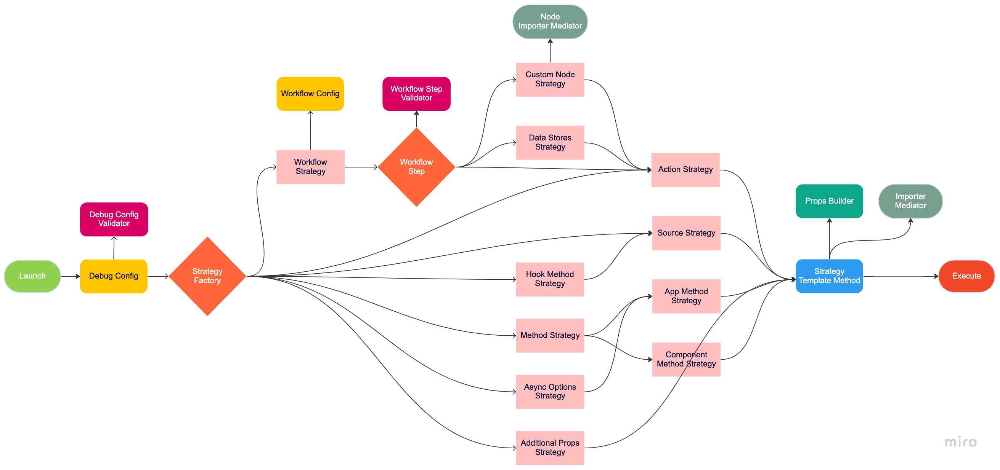

# Pipedream Workflow Debug

Debug your Pipedream Workflow locally or inside a Docker container!

**Note**: all local paths mentioned in this README considers `debug/` is used as the prefix unless specified otherwise.

## Table of Contents

- [API Keys](#API-Keys)
- [Debug Options Config](#Debug-Options-Config)
- [Workflow Config](#Workflow-Config)
- [Docker](#Docker)
- [VSCode Debugging](#VSCode-Debugging)
- [Architecture](#Architecture)
- [Current Limitations](#Current-Limitations)

### API Keys

Create a file in named `.env` that should include the API Key for every application within your workflow. Note that this file will not be uploaded to GitHub, but it will be copied to the Docker Image constructed in subsequent stages. Therefore, exercise caution regarding who has authorization to the Docker Image.

Each line should have the following structure:

```bash
${APP_NAME}=${API_KEY}
```

**Note**: The `APP_NAME` should be the app's `name_slug` in uppercase.

For example:

```bash
GITHUB=apikey1234
PIPEDREAM=apikey9876
GOOGLE_SHEETS=apikey1111
```

### Debug Options Config

The `debug-options.yaml` file contains the configuration for debugging.

These are the following options:

  - `runType`: defines which debugging type is to be executed, whether **workflow**, **action**, **hook**, etc. More details below.
  - `steps`: used to pass a value or an object that would be returned by the trigger in a workflow run, as if the source had emitted the event. This object will be populated with the result of each step in the workflow to be executed.
  - `appName`: the name of the app imported by the component. Note that it is **not always** the `name_slug` defined in the app file, but rather the name that is being used when being imported in the component. For example, the Google Sheets app `name_slug` is **google_sheets**, but in most components it is being imported with the name **googleSheets**.
  - `key`: the component key. Does not include the app name.
  - `methodType`: whether the method to be executed is contained in the **app**, **action**, or **source** component.
  - `methodName`: the name of the method to be executed.
  - `propName`: the name of the prop for the **async options** function to be executed.
  - `props`: the props values configuration for the component. Acts as if they were configured in the Pipedream UI.
  - `event`: the event object to be be passed as an argument to the **run** function of the source component.
  - `args`: the arguments to be passed to the component's **method** or **async options** function to be executed.

These are the `runType` options for debugging:

#### Workflow

The default `runType`. In this mode, a `workflow.yaml` file is required. It should not be manually generated, but rather by the [Pipedream GitHub Integration](#Cloning-a-GitHub-Workflow). It contains the steps and the configured props for each step. You may add a `debug: false` config for a step that you wish to skip. Otherwise, each action step in the workflow will have its **run** method called, sequentially.

```yaml
runType: workflow               # required
steps:                          # optional, type: object
  ${step_name}:
    ${step_result}
```

#### Action

In this mode, a single action component will be executed. Both `appName` and `key` are required. If the action requires props to be configured, they must be declared in the `props` config. Then, the **run** method is invoked.

```yaml
runType: action                 # required
appName: ${app_name}            # required
key: ${component_key}           # required
props:                          # optional, type: object
  ${prop_name}: ${prop_value}
```

#### Source

In this mode, a single source component will be executed. Both `appName` and `key` are required. If the source requires props to be configured, they must be declared in the `props` config. An `event` object may also be declared. Then, the **run** method is invoked.

```yaml
runType: source                 # required
appName: ${app_name}            # required
key: ${component_key}           # required
props:                          # optional, type: object
  ${prop_name}: ${prop_value}
event:                          # optional, type: object
  ${event_object}
```

#### Method

In this mode, a method located in a component's **app**.methods, **action**.methods, or **source**.methods will be invoked. These are the possible `methodType`s. The `methodName` and `appName` are also required. If the `methodType` is **action** or **source**, then `key` is required. You can also declare the `args` that will be passed as parameters to the method.

```yaml
runType: method                 # required
methodType: ${method_type}      # required, values: [ app | action | source ]
methodName: ${method_name}      # required
appName: ${app_name}            # required
key: ${component_key}           # required if methodType === [ action | source ]
args:                           # optional, type: object
  ${args_object}
```

#### Hook

In this mode, either the **deploy**, **activate**, or **deactivate** `methodName` located in a source's hooks will be invoked. The `appName` and `key` are both required. You can also declare the `props` that will be configured in the source.

```yaml
runType: hook                   # required
appName: ${app_name}            # required
key: ${component_key}           # required
methodName: ${method_name}      # required, values: [ deploy | activate | deactivate ]
props:                          # optional, type: object
  ${prop_name}: ${prop_value}
```

#### Async Options

In this mode, the **async options** function for a prop will be invoked. To specify which prop, the `appName` and `propName` configs are required. You can also declare the `args` parameter that will be passed into the function. Usually, `args` may contain `prevContext` and previously configured props.

```yaml
runType: asyncOptions           # required
appName: ${app_name}            # required
propName: ${prop_name}          # required
args:                           # optional, type: object
  ${args_object}
```

#### Additional Props

In this mode, the **additionalProps** method for a `action` or a `source` component will be invoked. This should be defined by the `methodType` config. The `appName` and `key` are also required. You can also declare the `props` that will be configured in the component.

```yaml
runType: additionalProps        # required
methodType: ${method_type}      # required, values: [ action | source ]
appName: ${app_name}            # required
key: ${component_key}           # required
props:                          # optional, type: object
  ${prop_name}: ${prop_value}
```

### Workflow Config

An example `workflow.yaml` is included with steps and props configured. It is required when specifying the [workflow run type](#Workflow). Note that to skip execution of a specific step, add a `debug: false` config in it.

#### Cloning a GitHub Workflow

To debug a workflow that is hosted on GitHub, follow these steps:

1. Clone the workflow repository

```bash
cd ~
git clone https://github.com/you/workflow-repo.git
```

2. Copy all the contents inside the folder of the workflow you want to debug. That will include `workflow.yaml` and the code of the components in folders for each step.

```bash
cp -r workflow-repo/workflow-folder/* pipedream-repo/debug/
```

3. Configure `debug-options.yaml` with the workflow run type and you are set to debug your workflow.

### Docker

If you wish to manage the debugging inside a Docker container to avoid executing code in your local workstation, you can build an image and run it in a container. You can also use [VSCode to connect to the running container and debug it remotely](#Remote-Container-Debugging).

**Note**: Run these commands in the pipedream project root directory.

#### Build image

```bash
docker build -t pipedream:debug-workflow .
```

#### Run once and save the results

```bash
docker run pipedream:debug-workflow &> ./debug/results.txt
```

#### Run and leave it in the background for debugging

```bash
docker run -dt --name pipedream pipedream:debug-workflow /bin/bash
```

### VSCode Debugging

With VSCode you can either debug locally or remotely, by connecting to a running Docker container.

#### Local Debugging

1. In the pipedream project root directory, create a `.vscode/launch.json` file with the following content:

```json
{
  "version": "0.2.0",
  "configurations": [
    {
      "name": "Debug Pipedream Workflow",
      "request": "launch",
      "type": "node",
      "program": "${workspaceFolder}/debug/src/launch.mjs"
    }
  ]
}
```

2. Then add some breakpoints and start debugging.

#### Remote Container Debugging

1. After [starting a container running in the background](#Run-and-leave-it-in-the-background-for-debugging), open VSCode and install the **Microsoft Remote Explorer extension**.
2. Then go to the **Remote Explorer** tab and you will see a list of containers. Click with the right button and select **Attach to Container**.
3. With the new instance of VSCode, you can start debugging in it.

Note that any code changes and execution will be inside the Docker container and won't affect your local workstation.

### Architecture

<p align="center">
  <br />
  
  <br />
</p>

#### launch.mjs

It is the entry point. It starts by creating the debug configuration.

#### Debug Config and Validator

The **DebugConfig** class loads the configuration options from `debug-options.yaml` and the API keys from `.env`.
It passes through validation to ensure that the required configurations for each `runType` are correctly defined.

#### StrategyFactory

This is where the specified [Strategy](https://refactoring.guru/design-patterns/strategy) is selected and created according to [DebugConfig](#Debug-Config-and-Validator).
All strategies implement two basic methods: `setup` and `execute`.

#### Setup and Strategy Template Method

Setup is a [Template Method](https://refactoring.guru/design-patterns/template-method) defined in **StrategyTemplateMethod** and is always called before execute. The strategy subclasses may override the implementation of specific steps inside the structure of the algorithm.

There are 3 main steps in the setup process:

1. It imports the app and/or component files or any other file that will be required with [ImporterMediator](#Importer-Mediator).
2. It sets up the props with **PropsBuilder** reading the defined values from `debug-options.yaml` or `workflow.yaml` as if they were configured in the Web UI.
3. It loads the API keys from the `.env` file and injects them in the app.

Each strategy may need to override subtle changes in each of these steps.

#### Importer Mediator

This class imports the app and/or the component.

#### Custom Node Component Importer Mediator

This class imports a custom component, along with any other file that is required. It also installs all `npm` dependencies required by the custom component and runs a few steps to be able to execute the `run` method. It is a subclass of [Importer Mediator](#Importer-Mediator).

#### Workflow Strategy and Workflow Step Validator

This strategy reads a `workflow.yaml` file and executes step by step, in order, saving the results so they can be accessed in subsequent steps. For each step, it will build either a [CustomNodeStrategy](#Custom-Node-Strategy), [DataStoresStrategy](#Data-Stores-Strategy), or [ActionStrategy](#Action-Strategy).

#### Action Strategy

This strategy runs a [Action Component](https://pipedream.com/docs/workflows/steps/actions/#actions), injecting Pipedream's [$. built-in functions](https://pipedream.com/docs/workflows/built-in-functions/#built-in-functions).

#### Custom Node Strategy

This strategy runs [Custom Node.js Components](https://pipedream.com/docs/code/nodejs/#how-pipedream-node-js-components-work). It is a subclass of [ActionStrategy](#Action-Strategy).

#### Data Stores Strategy

This strategy simulates a [Data Store](https://pipedream.com/docs/data-stores/#data-stores) in Pipedream. It is a subclass of [ActionStrategy](#Action-Strategy).

#### Source Strategy

This strategy runs a [Source Component](https://pipedream.com/docs/workflows/steps/triggers/#app-based-triggers), passing in an `event` object, if defined in the configuration.

#### Hook Method Strategy

This strategy runs a [Source Hook](https://pipedream.com/docs/components/api/#hooks). It is useful for testing a `deploy` method, for example. It is a subclass of [Source Strategy](#Source-Strategy).

#### Method Strategy

This strategy runs a method defined inside an [App](#App-Method-Strategy) or [Component](#Component-Method-Strategy).

#### Component Method Strategy

This strategy runs a method defined inside a component. It configures the props and arguments that are passed to the method. It is a subclass of [Method Strategy](#Method-Strategy).

#### App Method Strategy

This strategy runs a method defined inside an app file. There are no props to be configured, only arguments to be passed to the method. It is a subclass of [Method Strategy](#Method-Strategy).

#### Async Options Strategy

This strategy runs the [Async Options](https://pipedream.com/docs/components/guidelines/#async-options) function for a selected prop. Be sure to pass the required arguments and previously configured prop values as if it were running in Pipedream. It is a subclass of [App Method Strategy](#Method-Strategy).

#### Additional Props Strategy

This strategy runs the [Additional Props](https://pipedream.com/docs/components/api/#dynamic-props) function in a component. It configures the props.

#### Execute

This is the final step of a strategy. It ends in a result or error.

### Current Limitations

- Cannot run specific component versions from the global registry, uses latest only
- Does not support Python steps and other languages other than Node.js
