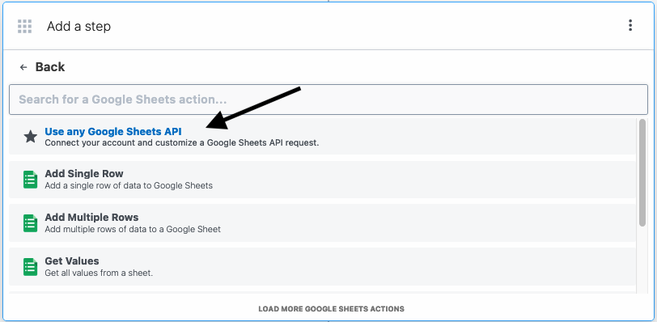

# Pipedream Component Local Debugging

Tutorial on how to locally run and debug Pipedream components

Currently supports running:

- apps:
    - `methods`
    - `async options` in propDefinitions
- actions:
    - `run` method with props
    - `methods`
    - `async options`
- sources:
    - `run` method with props
    - `methods`
    - `async options`
    - `hooks`: `deploy`, `activate`, `deactivate`
    - `db` prop
    - `http` prop (URL only, doesn't support running a local server)

Limitations:

- Doesn't support running a local server for receiving Webhooks
- Not tested with TypeScript components

## Steps

1. Install all dependencies in pipedream project root (needed once only):

    ```sh
    $ pnpm install
    ```

1. Install all required dependencies:
    ```sh
    $ npx pnpm install -r
    ```

1. Obtain the token associated to your account and export it to the terminal. You can `console.log()` the token from a action step.

    ```sh
    $ export AUTH_TOKEN=TOKEN
    ```

    <p align="center">
        
    </p>

     <p align="center">
        
    </p>

1. Import app and action:

    ```js
    import appBase from "../components/google_sheets/google_sheets.app.mjs";
    import actionBase from "../components/google_sheets/actions/add-single-row/add-single-row.mjs";
    ```

1. Configure app name prop (it may not be the same as the app key):

    ```js
    const appName = "googleSheets";
    ```

1. Configure app `$auth` if needed. You can also insert the string here directly:

    ```js
    const AUTH_TOKEN = process.env.AUTH_TOKEN;
    ```

1. Configure HTTP endpoint for Webhooks if needed.

    ```js
    const httpEndpoint = "https://eoas9i0rbuif71x.m.pipedream.net";
    ```

1. Configure all necessary action props as if you were in the UI:

    ```js
    function setupProps() {
        component.props.sheetId = "11s9s17G4WySY_lc0fb1tHFooqZ2B66poAxusq5ptUS8";
        component.props.sheetName = "Sheet1";
        component.props.hasHeaders = "No";
        component.props.myColumnData = [
            "this",
            "is",
            "a",
            "test",
        ];
        ...
    }
    ```

     <p align="center">
        
    </p>

1. Optionally override action/source `run()` method:

    ```js
    function overrideRun(action) {
        component.run = async () => {
            console.log("Run was overriden!");
        };
    }
    ```

1. Optionally test a prop options:

    ```js
    await runAsyncOptions(component, "propName", args = {});
    ```

1. Optionally test a component method or hook:

    ```js
    await runMethod(component, METHOD_TYPES.COMPONENT, "methodName", args = {});
    ```

1. Optionally test an app method:

    ```js
    await runMethod(component, METHOD_TYPES.APP, "methodName", args = {});
    ```

1. Run code and check the result:

    ```sh
    $ node ./debug/debug.mjs
    ```

     <p align="center">
        
    </p>

     <p align="center">
        
    </p>

1. Change whatever code you desire :)

## Configure debug in VSCode

You can run the code in debug mode in VSCode with breakpoints and inspect variables.

1. Create a `.vscode/launch.json` file (or generate it) with the following content:

    ```json
    {
        "version": "0.2.0",
        "configurations": [
            {
                "type": "node",
                "request": "launch",
                "name": "Launch Program",
                "skipFiles": [
                    "<node_internals>/**"
                ],
                "program": "${workspaceFolder}/debug/debug.mjs",
            }
        ]
    }
    ```

2. Add some breakpoints

3. Press `F5` or click on `Launch Program`


